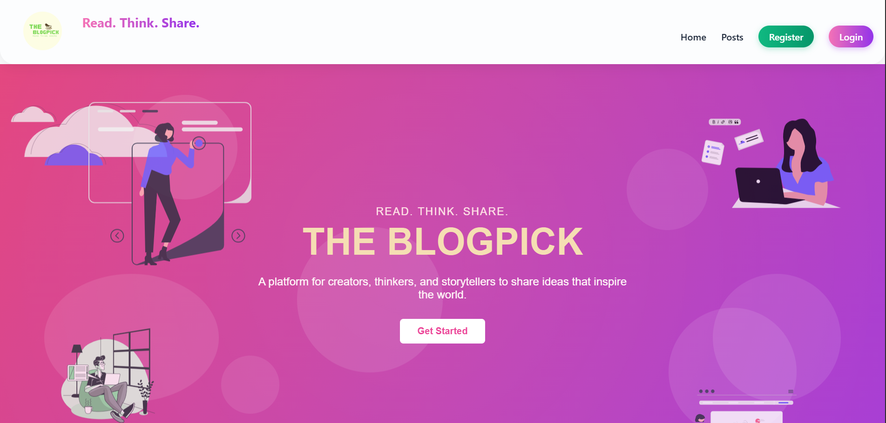
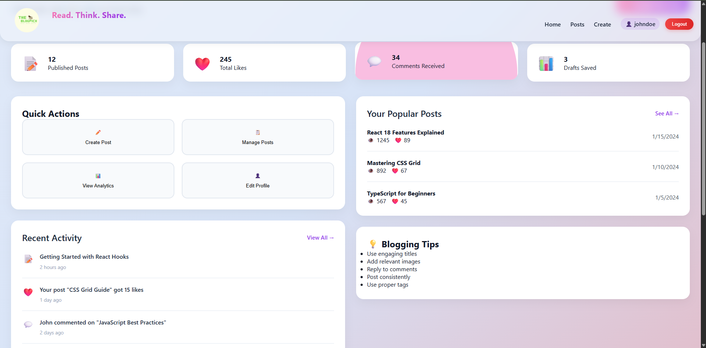
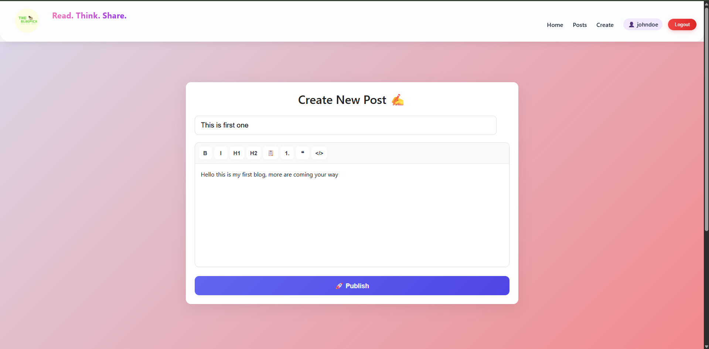

# 📝 BlogPick

A simple blogging web application currently under development, focused on creating and reading blog posts with a clean and minimal interface.

---

## 🚧 Project Status

⚠️ This project is currently in development.  
New features and improvements are being added regularly.

---

## 🖼️ Preview

<p align="center">
  
</p>

---

## 📸 Screenshots

<p align="center">
  
  
</p>

<p align="center">
  
</p>

---

## 🧠 Features (Current)

- 📝 Create blog posts  
- 📖 View blog content  
- 🎨 Clean and simple UI  

---

## 🔧 Planned Features

- ✏️ Edit & delete posts  
- 🔐 Authentication (Login/Signup)  
- ❤️ Like / interaction system  
- 📂 Category-based filtering  

---

## ⚙️ Installation

```bash
git clone https://github.com/Yatharth-Dubey/blogpick
cd blogpick
npm install
npm start